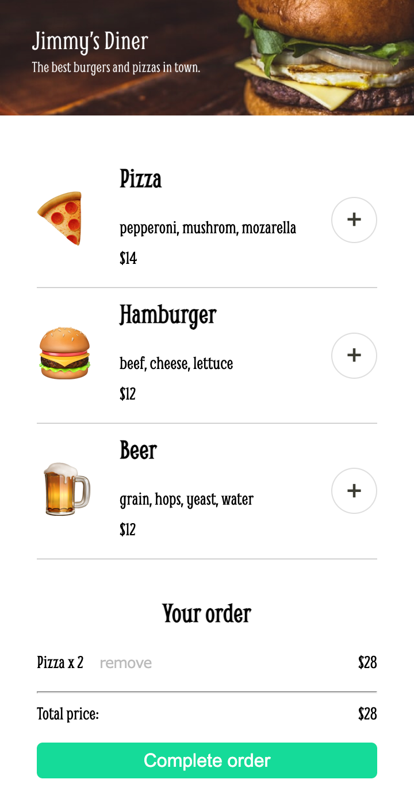
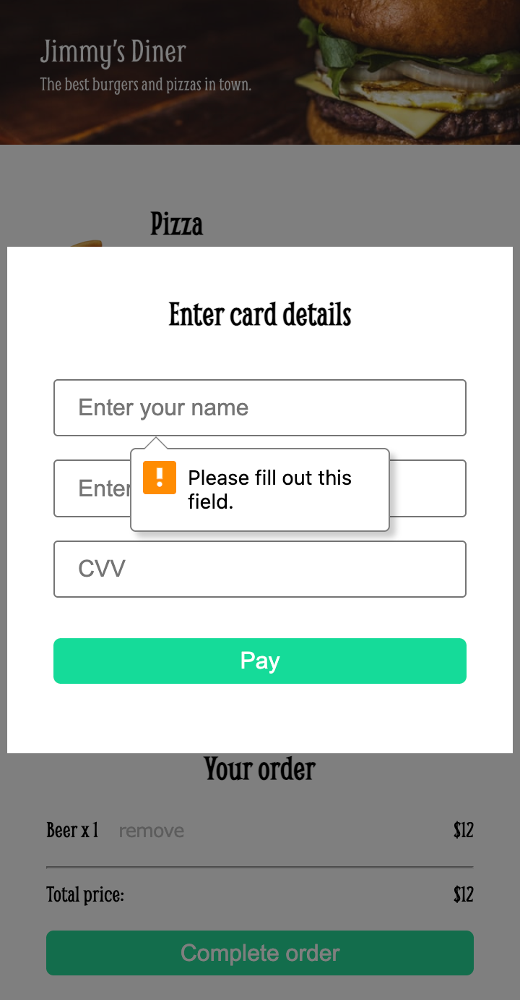
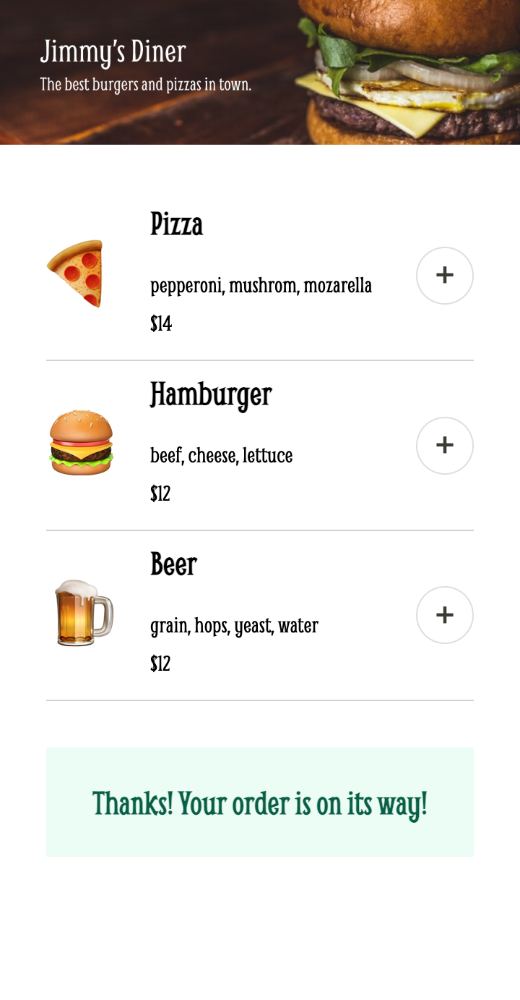

This is a solo project from Scrimba. It builds an online order app.

## App Preview
* When a user clicks on the plus button, the order section will appear at the bottom and shows whatever they've added to their order with its price, the option to remove it, a total price of everything they've ordered, and a complete order button.  
 

* When the user click on the complete order button, he will see this payment modal. These inputs are compulsory.  
 

* When the user has completed the form and clicks pay, the your order section is replaced by a message which says the order is on the way.  
 

## Key technical points
* It creates a separate array to store the ordered products, and only render this array for the summary section. It sycs up with the original data in data.js.

* Not to use `{!menu.ordered && "invisible"}`. It will add a false class to the vid. 
```js
summaryEl += menuArray.map(menu => `
    <div class="single-ordered-product-container ${menu.ordered ? "" : "invisible"}">
        <div>${menu.name}</div>
        <button data-remove-id=${menu.id}>remove</button>
        <div>${menu.price}</div>
    <div>
    `).join("")
```

* Remember to add the [0] because we need to get an object for shallow copy to work, not a new array. 
* orderArray has a reference to the orderedProduct, so when orderedProduct changes, the orderArray will also change. 
```js
function addProduct(id) {
    const orderedProduct = menuArray.filter(menu => menu.id === Number(id))[0]
    if (orderArray.includes(orderedProduct)) {
        orderedProduct.orders ++
    } else {
        orderedProduct.orders ++ 
        orderArray.push(orderedProduct)
    }
    renderSummarySection()
}
```