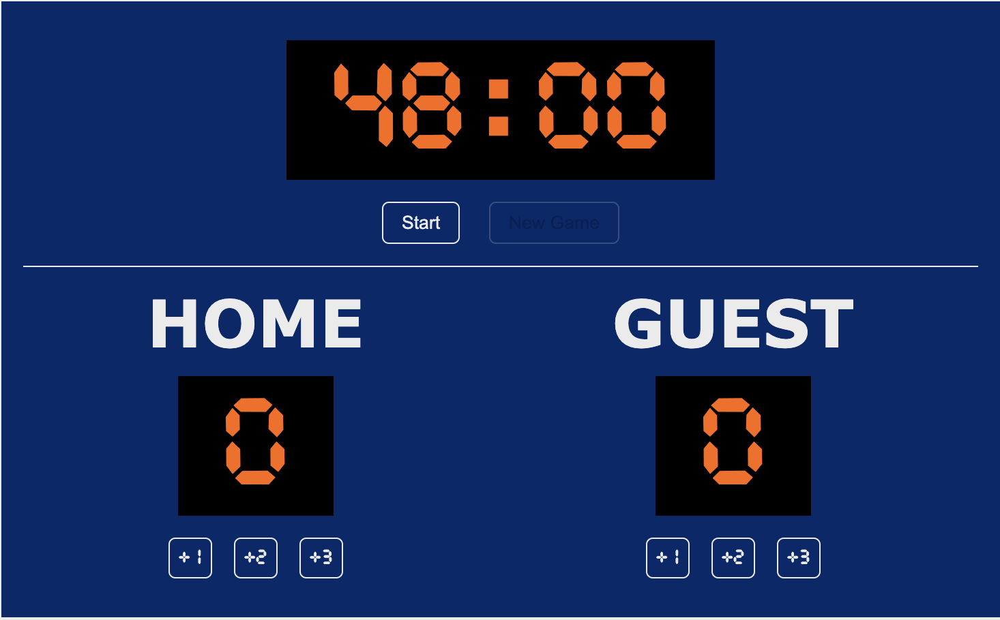
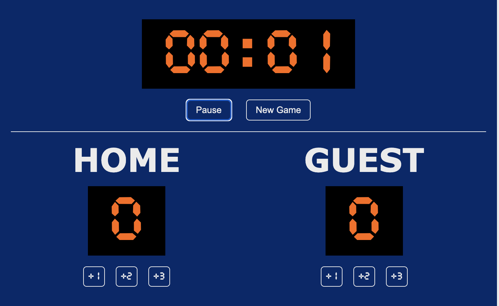
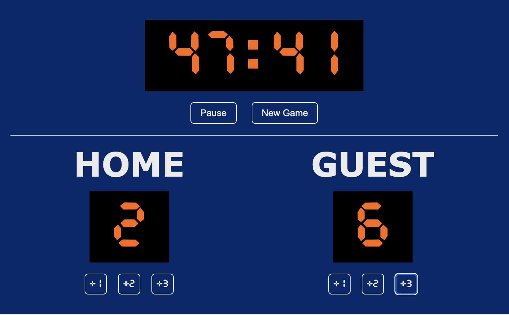
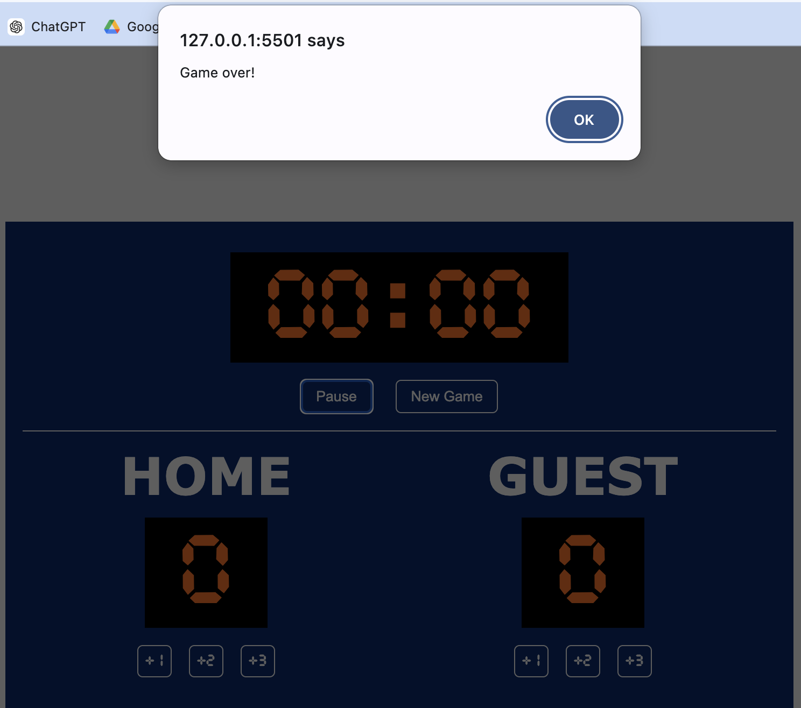
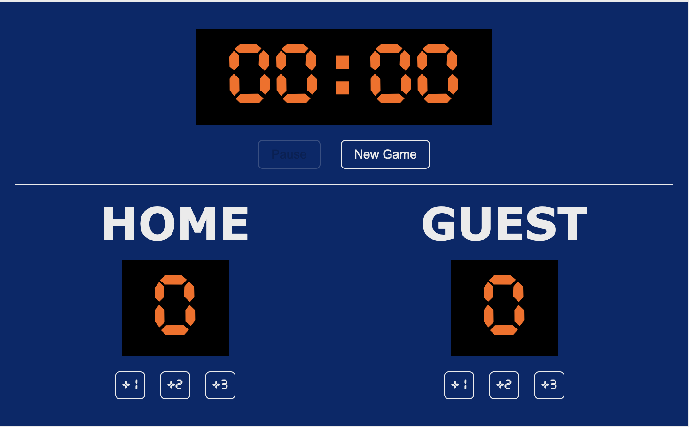

This is a basketball scoreboard app built using JavaScript, HTML, and CSS for tracking and displaying basketball game scores in real-time. It allows users to start, pause and resume the game.  

The key learning points from this sole project: 
* script tag
* variables
* numbers & strings
* function
* the DOM
* getElementById
* addEventListener
* textContent
* disabled
* setInterval & clearInterval
* @font-face & font-family

Display: 
* The new game button is default to be disabled. 

* After the game starts, start button is changed to pause button, and new game button is allowed. 

* Click the score buttons to add the score. 

* When the game ends, there will be a game over alarm. 

* New game is waited to be started.
