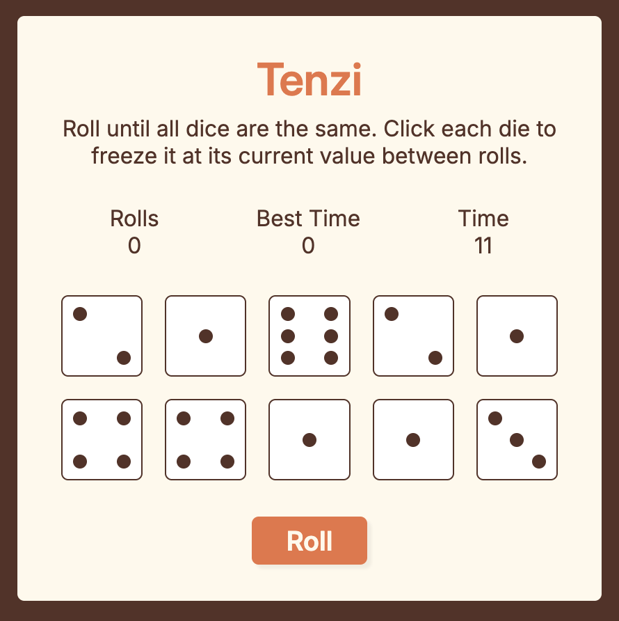

# Tenzi


## Install
```
npm install nanoid
npm install react-confetti
```

## Steps
1. Decide the design and create the basic html and css. 
2. In App component, create a state called dices, which is an array of 10 objects. Each of the object has these keys: id, value, isHeld
3. Create another component Dice, which renders the button. 
4. Map over the dices state, pass the props(value, id, isHeld) and render the Dice component.
5. Crate a generatAllDice function, and trigger it on the first render to generate random value.
6. Enable the hold feature: When a dice is clicked, the Dice component pass the id of the dice back to the App component. App will change the state based on the id. 
    * Generate a click function in App, and pass it as props to Dice
    * When roll button is clicked, run the click function with dice value as the parameter
    * The click function is designed to map over the array, find the element whose id is the passed id, and change the isHeld for that object.
7. Visualize the isHeld status by add a color to the held dice.
8. Enable the roll feature: When roll button is clicked, generate new value for the dices whose isHeld is false.
9. Enable the new game feature: When all the dices have the same value, and all the dices are held, generate a new game when clicking the new game button.
10. Count the roll: Increate the count state everytime the roll button is clicked, and reset it to 0 when new game button is clicked. 
11. Count the time: 
    * If winGame is false, use useEffect and setInterval to rerender the time state every second. 
    * When new game is clicked, reset it to 0; 
12. Best time: When winGame is true, compare the current time with the old bestTime to decide the new bestTime. 
13. Style the dice with pips: 
    * Create a pipMap: for each pip, the value is an array of the position for all the dots
    * In css, put each dot into the correct position on the dice, from 1st dot to 9th dot
    * Create the dotsEl: Find the position array based on the pip value, map over the array and create a new array of the jsx element. 
14. Add the confetti from react-confetti library.
15. Accessibility: Add the aria-label, aria-pressed and aria-live.


